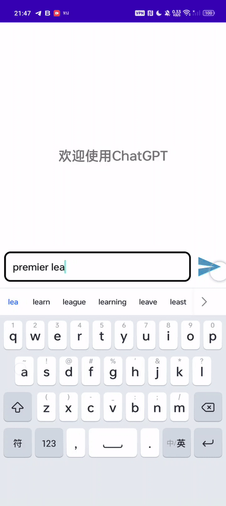
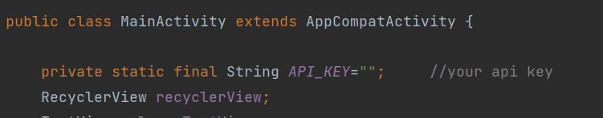

# ChatGPT Android Java

A simple ChatGPT Android Client in Java.

Implement OpenAI stream. 

Input your api and you are good to go.

# References
https://github.com/Grt1228/chatgpt-java

https://github.com/bimalkaf/Android_ChatGPT

https://github.com/Skythinker616/gpt-assistant-android

